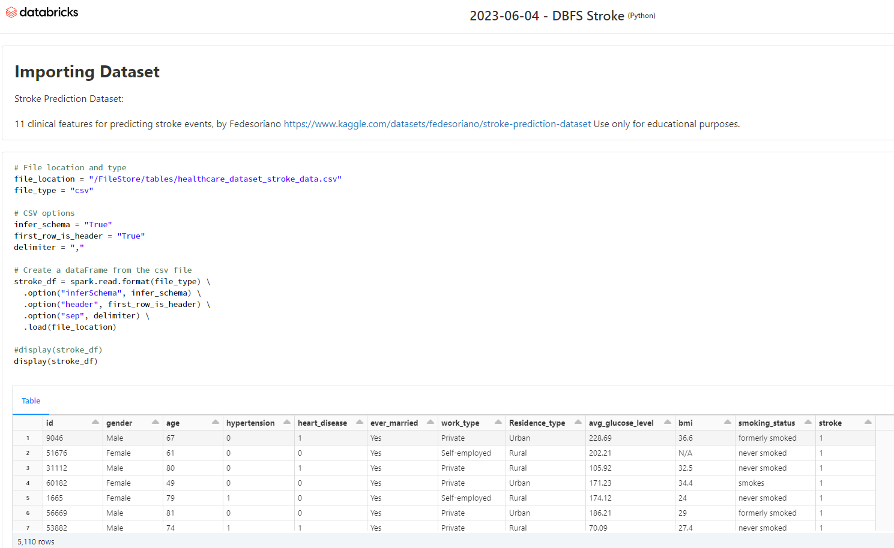
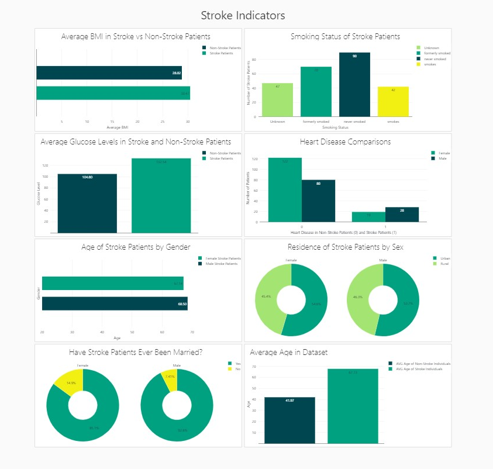

# Project4

For this project our team was tasked to solve, analyze, or visualize a problem using machine learning (ML) with other technologies that we’ve learned throughout our course while following specific requirements.

### Our Team: 

Leah Apking

Erin Clark

Nancy Gomez

Sheila Troxel

# Our Project - Predicting Stroke

### Exploring Datasets

To begin our project, we explored healthcare datasets, looking for data that included other health factors in addition to whether a patient had a stroke or not, as this would be key in helping us build a model that could predict with high accuracy. We found a dataset that has been built for stroke prediction online at Kaggle.com that included 11 clinical features for predicting stroke events. These features included: Gender, Age, Hypertension, Heart Disease, Average Glucose, BMI, Smoking Status, Work Type, Residence Type, Ever Married , and Stroke Status.

### Previewing Data

Using a DataBricks notebook, Python, and Spark SQL we were able to review and analyze the stroke prediction data to learn more about the patients included in the dataset and how the clinical features may factor into our predictions. 

Using a DataBricks notebook, we were able to easily develop visualization from our table and analysis to create dashboard for sharing and updating our findings. 

### Summary of Stroke Data Findings
In reviewing the `health-dataset-stroke-data.csv`, our data included patient data for 5110 individuals. Only 249 patients had experienced a stroke. With our data heavily weighted on non-stroke patients, we were curious if other factors in our dataset might affect our model. Here are our findings. 

 <ins> Average Age <ins> 
* Average age of patients in the dataset = 43.23
* Average age of non-stroke patients = 41.97
* Average age of stroke patients = 67.73

<ins> Health History <ins>
* More men in our dataset experience a stroke vs women only by a small margin.
* Heart disease and hypertension appeared more in non-stroke patients than with stroke patients.
* Patients that experienced a stroke had an average glucose level of 132.54 vs non stroke patients who averaged 104.80.
* Average BMI in both candidates differed by a small margin. Stroke patients had an average BMI of 30.47 and non-stroke patients had an average BMI of 28.82.

<ins> Lifestyle <ins>
* Where patients lived did not appear to have a significant impact on stroke or non-stroke individuals, with urban residences being slightly higher. 
  This could be simply due to higher population in urban areas.
* Only 90 stroke patients were non-smokers with 159 labeled as unknown, former smokers, or past smokers.
  
## Building the Machine Learning Model
Now that we have a better idea of what our data looks like, we can begin to build a model. 
  
Because our dataset contained a labeled categorical target variable, stroke (1) or no stroke (0), with 5110 data points, our model exploration included logistic regression, neural network, random forest, and K nearest neighbor machine learning models.

We saved our healthcare-dataset-stroke-data.csv to Amazon AWS ` https://project4-06052023.s3.us-east-2.amazonaws.com/healthcare-dataset-stroke-data.csv` which allowed us to use Spark to directly pull the data into our Google Colab notebook after importing our dependencies and packages and opening a SparkSession.

### Preprocessing the Data
Using Google Collab, we created notebook where we imported our dependencies, installed Spark and Java, set our environment variables and started a SparkSession. Next, we read in the healthcare-dataset-stroke-data.csv via AWS into a Spark DataFrame. During import Spark's `inferSchema` correctly cast all but one of our features. After converting from Spark to a Pandas DataFrame, we dropped the ID column and used `pd.to_numeric` to convert the BMI column to a float. Pandas allowed us to use `errors='coerce'` to force the “N/A” values to NaN, which had previously caused Spark to cast the column as objects. These rows containing NaN were then dropped from the dataset.

Now that we had a useable dataset, we converted our categorical features to numeric with `pd.get_dummies`. Our encoded preprocessed data as split into our features and target arrays and split into a training and testing dataset. Here we also noted that our target variable was extremely unbalanced with 4700 no stroke patients and 209 stroke patients. Finally, we used `StandardScalar` to scale our feature variables before proceeding to the machine learning modeling.

### Initial Machine Learning Modeling
Our initial round of testing used our unbalanced scaled data for training, and the imbalance caused all of these models to perform poorly. The testing data contained only `4.26%` positive targets, which allowed the models to classify every data point as ‘no stroke’ and still receive a 95 percent accuracy score. Therefore, we focused on the models’ ability to classify stroke patients, but found our small number of positive cases insufficient to train an accurate model. 
* Logistic Regression: Identified 0 stoke patients.
* Neural Network: Identified 0 stoke patients.
* K Nearest Neighbors: Identified 1 stoke patient.
* Random Forest: Identified 0 stoke patients.
When evaluating the neural network models we compared the model’s predictions to actual outcomes by having the model predict our testing data again allowing us to produce a classification report. Because of the skew of our data we could not rely on the standard model loss and accuracy scores produced by the accuracy metric as these showed 95.6 percent accuracy despite the model failing to identify a single stroke patient.

### Optimization and Resampling
To address the imbalance of our dataset we resampled our data training data with imblearn’s `RandomOverSampler`. The resampled dataset was made up of 3526 stoke outcomes and 3526 no stroke outcomes for the model to train on. This resampled, scaled data was then used to train the same machine learning models used in our initial testing.
* Logistic Regression: Identified 42/54 stoke patients. Balanced accuracy: 0.755
* Neural Network: Identified 0 stoke patients.
* K Nearest Neighbors: Identified 4 stoke patients.
* Random Forest: Identified 0 stoke patients.
After resampling our data the network model and random forest still failed to identify a single stroke patient in our testing data, overall these models did worse than previously because they both failed to identify stroke patients and misidentified non stroke patients as stroke patients. The K Nearest Neighbors improved slightly, but not enough to continue testing. While the logistic regression model improved dramatically, identifying 77.8 percent of our stroke patients.

Finally, to make sure we had thoroughly tested the neural network model we ran a keras tuner to search for different combinations of layers, neuron values, and activation functions with our resampled data. We gave the model the option of the relu, tanh, and sigmoid activation functions initially using one to six layers with one to 20 neurons each in steps of five or a maximum of 20 epochs. When that produced similar results to our previous neural networks we tried increasing the number of layers and neurons, and then decreasing the parameters. Each run of the keras tuner resulted in a best model with different activation function, a loss of over 0.50 and an accuracy of 0.96. The classification report showed that none of these neural network models identified more than six of our stroke patients, much less than our logistic regression model.

### Final Stroke Model
Our final model for identifying stroke patients in our dataset which contained features of age, gender, hypertension, heart disease, marriage, employer type, residence (urban/rural), average glucose level, body mass index, and smoking status was a logistic regression model. The data used for this model was imported from AWS using Spark, then cleaned in Pandas including converting categorial data to numeric. The data was divided into features and targets and split into training a testing sets before being resampled using RandomOverSampler which created a new set of training data containing an equal number of each target variable and then scaled using StandardScaler.

This resampled, scaled training data was then used to train a logistic regression model. The model was then used to predict the outcomes of our testing dataset which contained 54 stroke patients and 1174 non stroke patients. The model successfully identified 43 stroke patients, `79.6%`, with a balanced accuracy score of `0.783`. The model was saved to `stroke_model_LR.h5` using joblib.

### Summary
Our focus when building this model was to identify stroke patients with the hope of being able to predict which patients are at a high risk of having a stroke in the future. We did our best to accommodate the lopsided dataset, which upon further investigation was not highly representative of the demographic most likely to suffer or have suffered a stroke. Given a larger more targeted dataset, such as older adults, with additional features such as family history, LDL cholesterol levels, presence of diabetes, or race and ethnicity it is likely that further modeling can help more accurately identify patients at a greater risk for stroke.

### Technologies Used
* AWS S3
* Google Colab
* Pandas
* DataBricks
* PySpark & Spark SQL
* TensorFlow
* Scikit-Learn
* ImbalancedLearn
* Keras-Tuner
 
### Presentation 
The presentation of our project can be found in Canva using the link below:
 
https://www.canva.com/design/DAFkiGOItBE/zRdBrhNwD--8_1JE2aML6Q/view?utm_content=DAFkiGOItBE&utm_campaign=designshare&utm_medium=link&utm_source=publishsharelink
 
